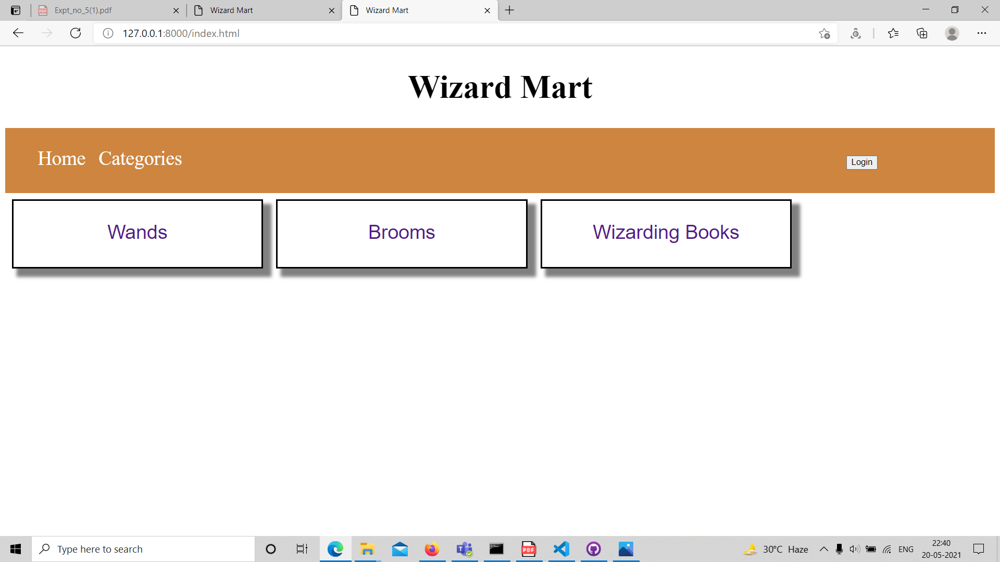
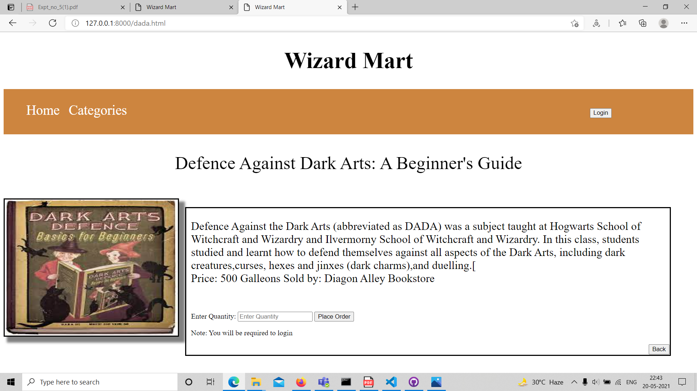

Greetings!!
This repository contains the submission of Vighnesh Deshpande(Roll No. 200107093) for the SWC Workshop Project.
The salient Features of the project I made are:
1. The website sells Wizarding Stuff across 3 categories:
    a. Wands 
    b. Brooms
    c. Books

2. Each of these categories have their own page and each of them offers 3 products.

3. Each product has its own page where some information about the product and its price are listed. You can place an order for the product if its available.

4. You are required to login before placing an order if you had not logged in previously.

5. After Placing the order successfully it gives a confirmation page.

6. Website allows you to create an account and then sign-in and aslo allows you to logout anytime.

7. It displays the login/logout button on the navigation bar depending upon whether you are logged in or not

8. It displays the name of the user currently logged in the home page besides the logout button.

I would like to inform you certain defects in my project:
1. The categories link in the navigation bar is not active.Instead Home link will take you to the categories page.I was planning to make a new homepage and link the categories page to the categories link but didn't get time to do it.
2. Due to some issue not known the images for brooms in brooms product description are not displayed on the screen. Sorry for the inconvinience caused.

Regards,

Vighnesh Deshpande
First Year Chemical Engineering
Roll No. 200107093
